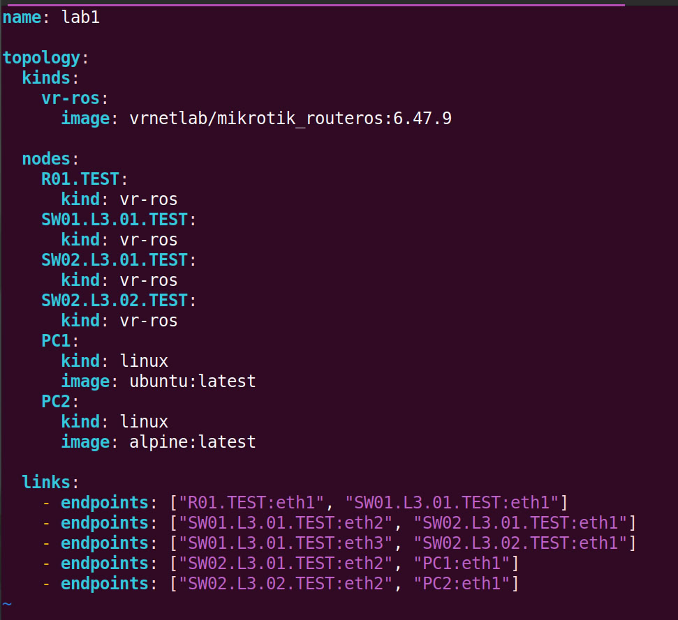
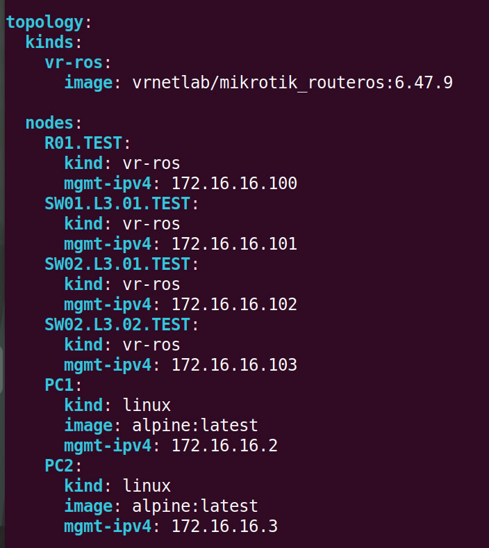
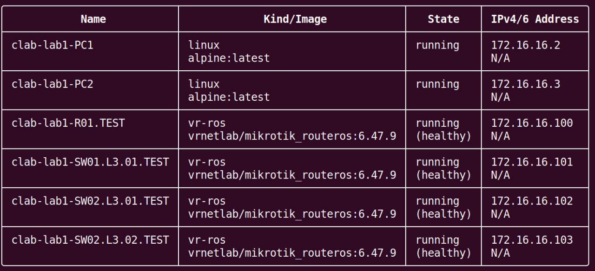
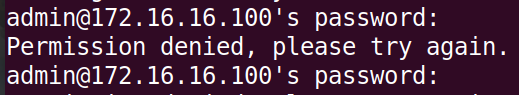

University: [ITMO University](https://itmo.ru/ru/)<br />
Faculty: [FICT](https://fict.itmo.ru)<br />
Course: [Introduction in routing](https://github.com/itmo-ict-faculty/introduction-in-routing)<br />
Year: 2025/2026<br />
Group: K3323<br />
Author: Krestyanova Elisaveta Fedorovna<br />
Lab: Lab1<br />
Date of create: 14.09.2025<br />
Date of finished: 22.09.2025<br />

# Задание

Вам необходимо сделать трехуровневую сеть связи классического предприятия изображенную на рисунке 1 в ContainerLab. Необходимо создать все устройства указанные на схеме и соединения между ними, правила работы с СontainerLab можно изучить по ссылке.


Подсказка №1: Не забудьте создать mgmt сеть, чтобы можно было зайти на CHR<br/>
Подсказка №2 Для mgmt_ipv4 не выбирайте первый и последний адрес в выделенной сети, ходить на CHR можно используя SSH и Telnet (admin/admin)

- Помимо этого вам необходимо настроить IP адреса на интерфейсах и 2 VLAN-a для PC1 и PC2, номера VLAN-ов вы вольны выбрать самостоятельно.
- Также вам необходимо создать 2 DHCP сервера на центральном роутере в ранее созданных VLAN-ах для раздачи IP адресов в них. PC1 и PC2 должны получить по 1 IP адресу из своих подсетей.
- Настроить имена устройств, сменить логины и пароли.

# Схема

В draw.io была нарисована схема сети.


# Установка ContainerLab

Инструмент ContainerLab был установлен на домашнем сервере в контейнере lxc. Для его работы было необходимо [установить докер](https://docs.docker.com/engine/install/ubuntu/) и в конфигурации lxc контейнера включить security.nesting.

Были установлены вспомогательные инструменты make и [vrnetlab](https://github.com/srl-labs/vrnetlab#). 

В папке /vrnetlab/mikrotik/routeros был скачан файл [chr-6.47.9.vmdk](https://download.mikrotik.com/routeros/6.47.9/chr-6.47.9.vmdk) и собран docker образ.

ContainerLab был установлен следующей командой:

```bash -c "$(curl -sL https://get.containerlab.dev)"```

# Базовая топология

Ознакомление с ContainerLab началось с создания базовой топологии. По схеме были созданы ноды, указаны их образы и связи между ними, ничего более.



Командой `clab deploy -t lab1.clab.yaml` производится деплой.


А командой `clab graph -t lab1.clab.yaml` строится граф топологии.


Т.к. в папке только один yaml файл, далее можно опускать "-t lab1.clab.yaml".

# Добавление сети управления

Чтобы можно было управлять устройствами, нужно создать сеть. В ContainerLab прописывается "mgmt" (management), которому задаётся имя сети и диапазон айпи-адресов. Затем всем устройствам прописывается их айпи в этой сети.



По заданию компьютерам должны раздаваться адреса через DHCP, но на этом шаге они пока побудут с айпи введёнными вручную.

Командой `clab redeploy -c` производится редеплой.



Сеть позволяет по заданным айпи-адресам зайти в конфигурацию устройств по ssh. К ssh лучше добавлять `-o "UserKnownHostsFile=/dev/null"`, так как при редеплое ключи ssh меняются, и каждый раз их удалять из known_hosts утомительно.


А в компьютеры можно зайти командой `docker exec -it <имя нода> sh`.

# Конфиги 

Со всеми конфигурациями можно ознакомиться в папке config.

В написании конфигов важно учитывать, что ether1 =/= eth1 в линках yaml файла. Ether1 забирается под eth0, поэтому в конфигах везде надо начинать забирать интерфейсы с ether2.

## Роутер R01

На роутере ставятся 2 dhcp сервера, по которому раздаются айпишки для vlan10 и vlan20.

Для этого указываются:

1. /interface vlan
2. /ip address (для обоих вланов по адресу, задаю 10.x0.0.1/24)
3. /ip pool (прописывается ranges, начинаю с 10.x0.0.10, до этого адреса резервирую для айпи роутеров/свитчей, как например выше строчкой)
4. /ip dhcp-server (указывается пул и интерфейс влана)
5. /ip dhcp-server network (gateway=адрес R01)

## Свитч SW01

Пометка: в задании все свитчи указаны как свитчи 3-его уровня, когда как в выполненном задании используется один и тот же роутер микротика. Но, по сути, большой разницы быть не должно.

Ситуация: от данного свитча идёт "2 подсети", одна на vlan 10 заточена, вторая на vlan 20. Нужно как-то фильтровать пакеты. Это делается с помощью [моста](https://help.mikrotik.com/docs/spaces/ROS/pages/28606465/Bridge+VLAN+Table).

1. /interface bridge (включаем vlan-filtering для безопасности)
2. /interface vlan (указываем в interface имя моста)
3. /interface bridge port (указываем все порты устройства в интерфейсах)
4. /interface bridge vlan (указываем айди влана и в tagged сам мост и все trunk порты, связанные с данным вланом.)
5. /ip address (тут указываю для обоих interface=vlanx0 айпи адреса address=10.x0.0.2/24. Устройства выстроились в рядочек)

Вообще, сетевым устройствам MikroTik-а можно указать динамический айпи через `/ip dhcp-client add disabled=no interface=bridge1`, но задание того не просит, и в рамках МикроТика это будет крайне неудобно, что будет видно ниже.

## Свитчи SW02

Дальше перед компьютерами стоят последние свитчи, на которых конфиги идентичны, меняются только номера вланов.

На этих свитчах тоже указывается мост, здесь нам важны его теги tagged/untagged. Если tagged нужен для trunk портов, то untagged для access портов.

1. /interface bridge
2. /interface vlan
3. /interface bridge port (у access порта надо указать port VLAN ID)
4. /interface bridge vlan (в untagged указывается access port)
5. /ip address (по традиции, 10.x0.0.3/24)

## Компьютеры

В задании сказано настроить 2 VLAN-а для компьютеров и получить через dhcp на них айпи адреса. На компьютерах стоит alpine, поэтому скрипт можно написать в формате bash. Компьютерам добавляется интерфейс vlan через `ip link`, и `udhcpc -i` запрашивает на этот интерфейс айпи у dhcp сервера. Наконец, записывается `ip route add 10.x0.0.0/24 via 10.x0.0.1 dev vlanx0`, чтобы компьютеры видели друг друга в сети.  Всё.

## Имена устройств и пользователи

В задании просят настроить имена устройств и заменить пользователя-администратора. Для этого всем сетевым устройствам прописывается /user и /system identity set name=/имя/. В юзер группе в моей лабе указано "full" - это [дефолтная группа](https://help.mikrotik.com/docs/spaces/ROS/pages/8978504/User#User-Defaultgroups) - т.к. новый пользователь заменяет администратора. В user также удаляется admin.

Больше на админа не зайти, даже вводя корректный пароль admin:



# Результаты

## Выдача адресов

На R01 можно увидеть, какие адреса выдались компьютерам, через команду `/ip dhcp-server lease print`.

Как мы можем заметить, компьютерам выдались айпи 10.10.0.10 и 10.20.0.10, как и ожидалось!


Э-э-э... кхм...

Оказывается, RouterOS (операционная система MikroTik) [выдаёт адреса, начиная с конца](https://forum.mikrotik.com/t/dhcp-ip-pool-lease-in-reverse/48974/12). Ладно. 

По этой причине я решила выдать статические айпишки интерфейсам vlan свитчей. Иначе им выдаются адреса с конца пула, что не стыкуется с красивым адресом 10.x0.0.1/24 роутера R01.

## Пинг

Пингуем с роутера другие сетевые устройства по интерфейсам вланов:


И компьютеры для полноты:


И демонстрируем успешную связь компьютеров, прописанную через ip route.


# Встреченные ошибки

## Установка ContainerLab в контейнере lxc

На моём сервере я привыкла размещать всё в отдельных контейнерах, чтобы ими удобно управлять. Это отлично подходит для хостинга сайтов.


Это не подходит для виртуализации!

Утилитой kvm-ok можно проверить, поддерживается ли kvm виртуализация на устройстве или нет. Она поддерживается на сервере? Да. Поддерживается в контейнере? Нет. Его можно [включить в контейнере](https://forum.proxmox.com/threads/kvm-inside-lxc-container.54168/), но эта задача останется на будущее.

## Путаница порядка ether

Я настоятельно пыталась использовать ether1 в конфигурации, и ничего не работало. Причина: это [зарезервированный интерфейс управления](https://containerlab.dev/manual/kinds/vr-ros/#interface-naming). Нет, он не ether0. Хотя соединён с интерфейсом Линукса eth0. Окей.

## Ошибки в конфигах

Пишешь конфиг sw02-01 - он работает. Пишешь идентичный конфиг sw02-02 - он... не работает!?<br />
Оказывается, криво копируя текст vim в блокнот для бэкапа, потом обратно в vim, я схватила по дороге лишнюю тильду, из-за чего весь конфиг не вызывался. Стыд и позор...

В целом, если в конфигах ошибки были, то он либо частично запускался, либо не запускался вообще. Почему-то я не заметила в логах докера или где-либо ещё записи об ошибках, отчего ошибочно думала, что деплой таскает какие-то артефакты конфигов. Пока самый лёгкий способ это дебажить, который я нашла на момент написания отчёта - заходить в пустое устройство и по порядку все команды вводить.

# Заключение

В ходе работы были созданы все устройства, указанные на схеме, и соединены через настройку IP адресов на интерфейсах и VLAN-ов на компьютерах. В центральном роутере были созданы 2 DHCP сервера для раздачи IP адресов в VLAN-ах компьютерам.

Цель создания трехуровневой сети связи классического предприятия была выполнена.
