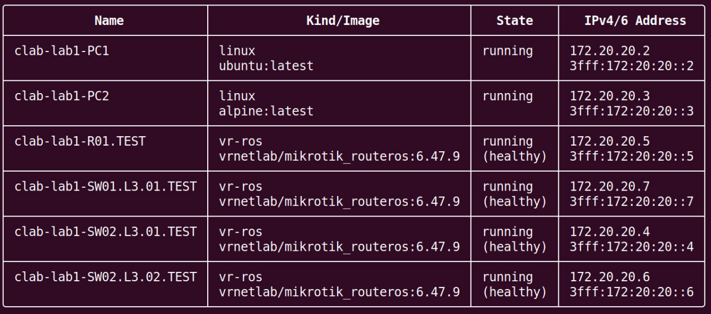

University: [ITMO University](https://itmo.ru/ru/)<br />
Faculty: [FICT](https://fict.itmo.ru)<br />
Course: [Introduction in routing](https://github.com/itmo-ict-faculty/introduction-in-routing)<br />
Year: 2025/2026<br />
Group: K3323<br />
Author: Krestyanova Elisaveta Fedorovna<br />
Lab: Lab1<br />
Date of create: 14.09.2025<br />
Date of finished: -<br />

# Установка ContainerLab

Инструмент ContainerLab был установлен на домашнем сервере в контейнере lxc. Для его работы было необходимо [установить докер](https://docs.docker.com/engine/install/ubuntu/) и в конфигурации lxc контейнера включить security.nesting.

Были установлены вспомогательные инструменты make и [vrnetlab](https://github.com/srl-labs/vrnetlab#). 

В папке /vrnetlab/mikrotik/routeros был скачан файл [chr-6.47.9.vmdk](https://download.mikrotik.com/routeros/6.47.9/chr-6.47.9.vmdk) и собран docker образ.

ContainerLab был установлен следующей командой:

```bash -c "$(curl -sL https://get.containerlab.dev)"```

# Базовая топология

Ознакомление с ContainerLab началось с создания базовой топологии. По схеме были созданы ноды, указаны их образы и связи между ними, ничего более.


Командой `clab deploy -t lab1.clab.yaml` был произведён деплой.

