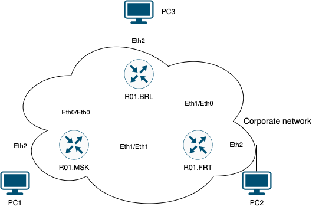
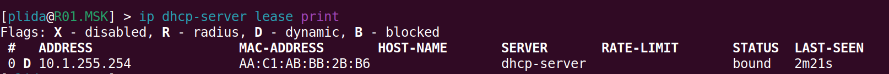
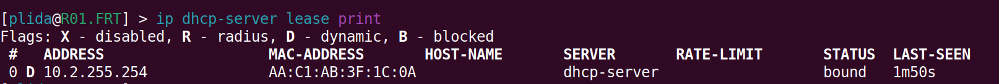
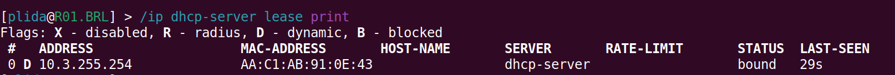
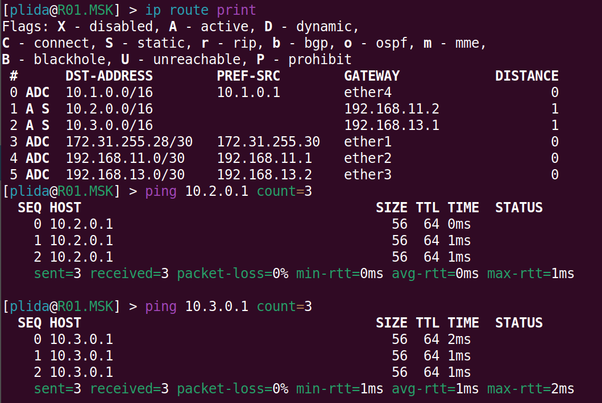
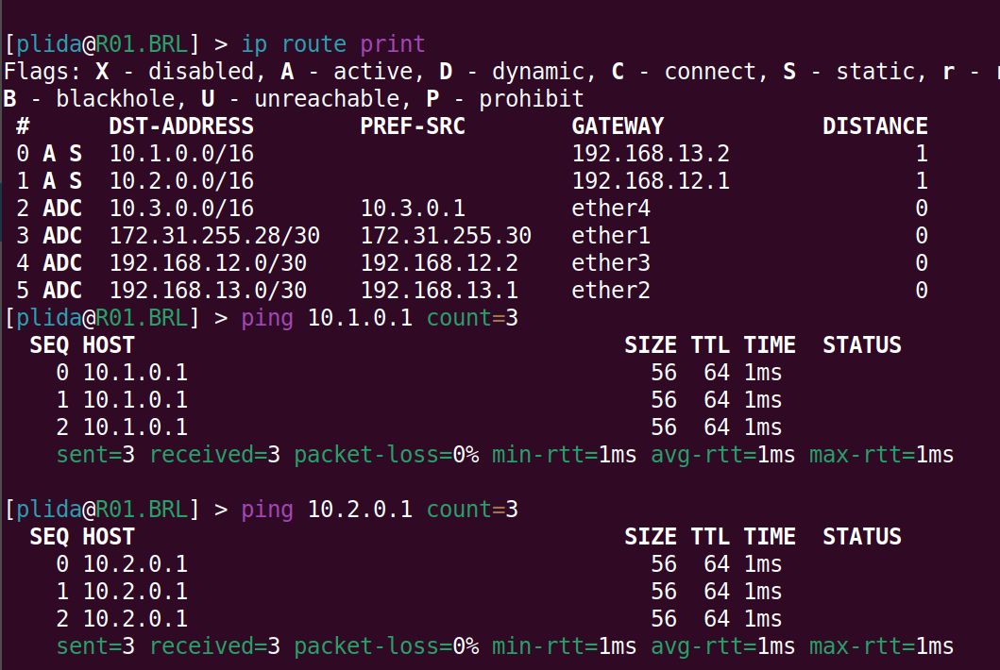
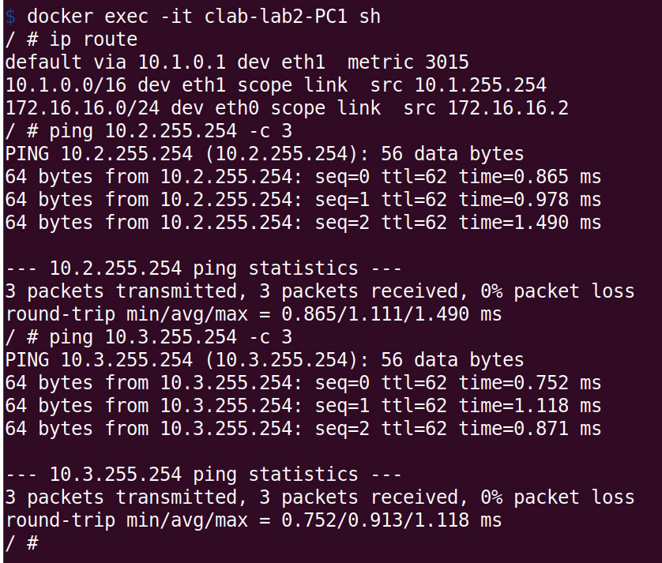
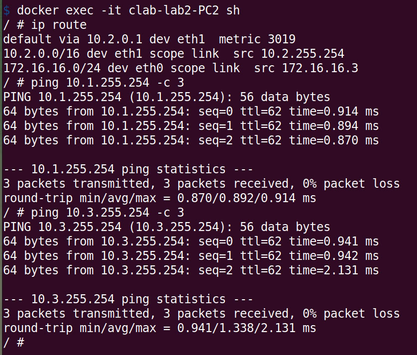
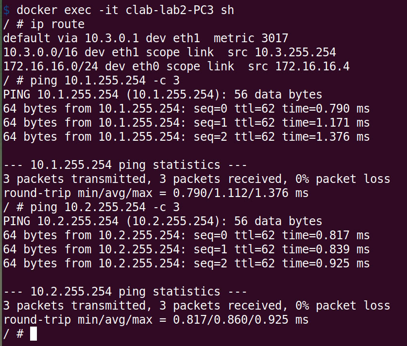

University: [ITMO University](https://itmo.ru/ru/) 
Faculty: [FICT](https://fict.itmo.ru) 
Course: [Introduction in routing](https://github.com/itmo-ict-faculty/introduction-in-routing) 
Year: 2025/2026 
Group: K3323 
Author: Krestyanova Elisaveta Fedorovna 
Lab: Lab2 
Date of create: 16.09.2025 
Date of finished: - 

# Задание

Вам необходимо сделать сеть связи в трех геораспределенных офисах "RogaIKopita Games".

Необходимо создать все устройства указанные на схеме и соединения между ними.

- Помимо этого вам необходимо настроить IP адреса на интерфейсах.
- Создать DHCP сервера на роутерах в сторону клиентских устройств.
- Настроить статическую маршрутизацию.
- Настроить имена устройств, сменить логины и пароли.

# Схема

Схема, построенная в draw.io:

Схема, построенная ContainerLab:

# Конфиг yaml

Конфиг во многом похож на конфиг предыдущей лабораторной, разве что добавился ещё один компьютер, а также связи по другому проведены. В этот раз каждый роутер подсоединён к своему компьютеру через eth3 и между собой через eth1 & eth2.

# Конфиги

## Роутеры

В этой лабораторной вместо vlan-ов необходимо прописывать статические руты. Задание DHCP аналогично R01 из предыдущей работы.

В конфигах роутера указывается:

1. /ip address (на всех 3 портах, в сторону компьютера 10.x.0.1/16 адрес)
2. /ip pool
3. /ip dhcp-server
4. /ip dhcp-server network
5. /ip route (сети 10.x.0.0 за другими 2 роутерами)
6. /user (добавляем plida, убираем admin)
7. /system identity

## Компьютеры

Компьютерам выдаются айпи адреса через dhcp: `udhcpc -i eth1`. Но ещё в этом задании возникла проблема, что в Containerlab у них выставляется дефолтный маршрут от сети управления в yaml конфиге, и он в приоритете. Из-за этого любые попытки послать запрос на другой компьютер заканчиваются передачью запроса на роутер моего провайдера, где этот запрос теряется. Поэтому на стартапе у компьютеров мы удаляем этот дефолтный рут `ip route del default via 172.16.16.1 dev eth0`. При надобности его можно добавлять обратно, но с большим значением metric.

# Результаты

## Раздача IP-адресов

## Соединение роутеров

## Соединение компьютеров

# Заключение

В ходе работы были созданы все устройства, указанные на схеме, и соединены через настройку IP адресов на интерфейсах. Были созданы DHCP сервера в сторону клиентских устройств. Наконец, была настроена статическая маршрутизация.

Цель создания сети связи в 3 геораспределенных офисах "RogaIKopita Games" была выполнена.

