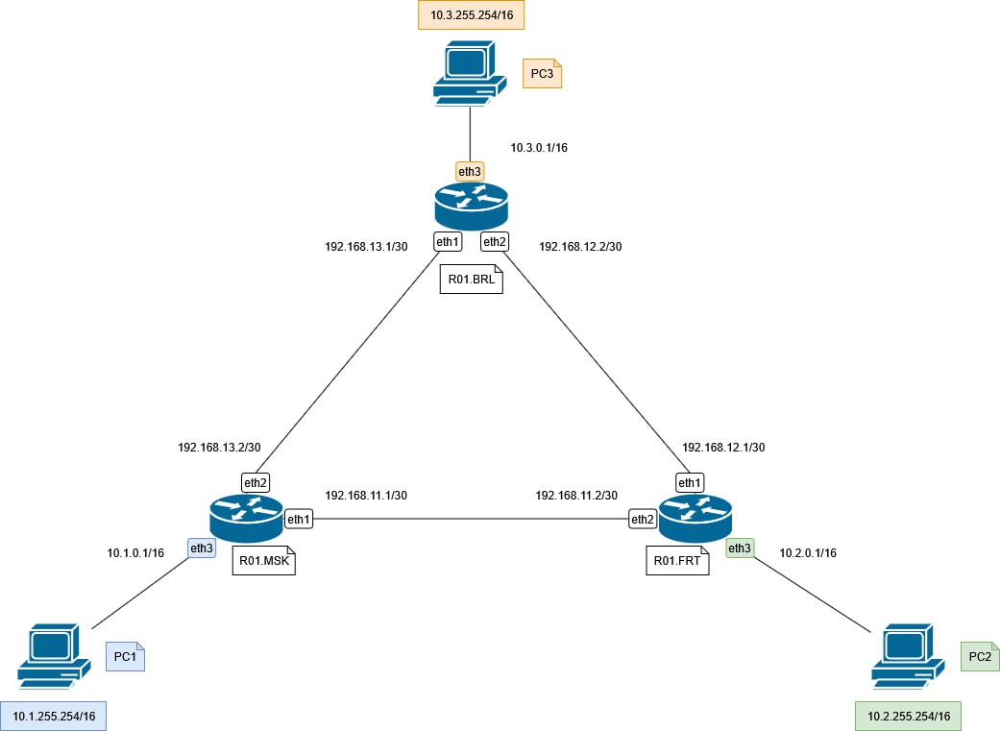
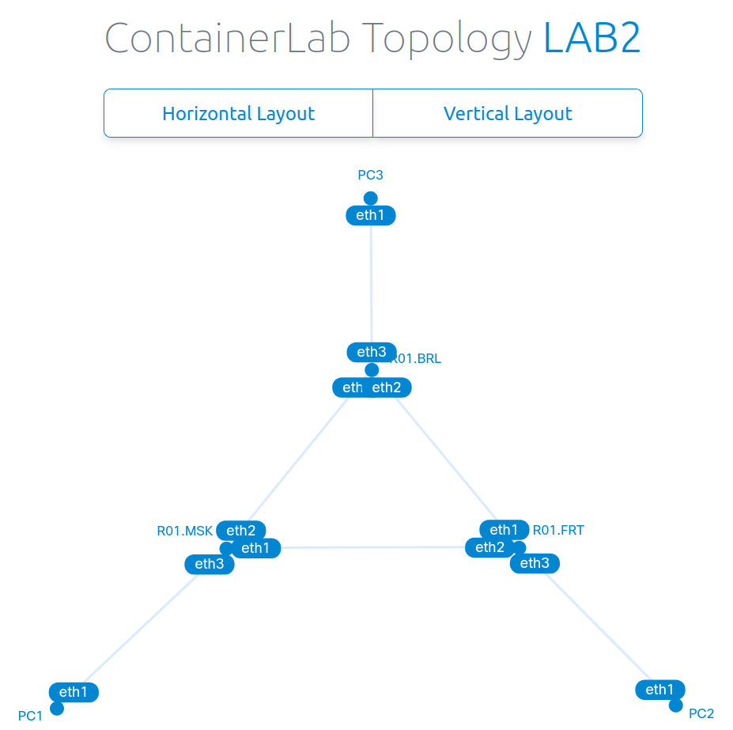

University: [ITMO University](https://itmo.ru/ru/) 
Faculty: [FICT](https://fict.itmo.ru) 
Course: [Introduction in routing](https://github.com/itmo-ict-faculty/introduction-in-routing) 
Year: 2025/2026 
Group: K3323 
Author: Krestyanova Elisaveta Fedorovna 
Lab: Lab2 
Date of create: 16.09.2025 
Date of finished: - 

# Схема

Схема, построенная в draw.io:

Схема, построенная ContainerLab:

# Выбор диапазона частных IP-адресов

В лабораторной работе не было задачи подобрать адекватные диапазоны в случае воображаемого расширения компании, но всё же было решено попробовать прикинуть, какие нужны диапазоны адресов. Дальнейшие рассуждения никак не влияют на саму лабораторную работу, и носят теоретический характер. 

Для сетей, в который работают компьютеры, было решено выбрать диапазон 10.0.0.0/16. На всякий случай. 65025 хостов может быть оверкилл, но если наша компания станет невероятно популярной и богатой, 255 - чересчур малое число, чтобы брать маску /24. Можно взять какую-нибудь промежуточную маску, но ради красоты конфигов в лабе было решено остановиться здесь. 

Между роутерами сети могут позволить себе маску /30, так как такие сети соединяют только 2 устройства (сами роутеры). Эти сети хотелось разделить визуально от сетей компьютеров, поэтому был взят диапазон 192.168.0.0/16. Этот диапазон используется часто и в домашних сетях, и необходимо избежать совпадения айпи корпоративных устройств и домашних устройств сотрудника, работающего из дома, поэтому если его использовать, то использовать 192.168.2.0 и выше. Хотя некоторые провайдеры и 192.168.10.0/16 занимают... В данной работе сети получили 192.168.11.0/30-192.168.13.0/30 адреса и ладно. Какие-то компании пользуются исключительно подсетями у 10.0.0.0/8, кто-то в 172.16.0.0/12 живёт, т.к. он редко используется, кто-то задаёт 192.168.(рандомное число).0/24. 

# Конфиг yaml

Конфиг во многом похож на конфиг предыдущей лабораторной, разве что добавился ещё один компьютер, а также связи по другому проведены. В этот раз каждый роутер подсоединён к своему компьютеру через eth3 и между собой через eth1 & eth2.

