University: [ITMO University](https://itmo.ru/ru/) 
Faculty: [FICT](https://fict.itmo.ru) 
Course: [Introduction in routing](https://github.com/itmo-ict-faculty/introduction-in-routing) 
Year: 2025/2026 
Group: K3323 
Author: Krestyanova Elisaveta Fedorovna 
Lab: Lab3 
Date of create: 30.09.2025 
Date of finished: 13.10.2025 

# Задание

Вам необходимо сделать IP/MPLS сеть связи для "RogaIKopita Games" изображенную на рисунке 1 в ContainerLab. Необходимо создать все устройства указанные на схеме и соединения между ними.

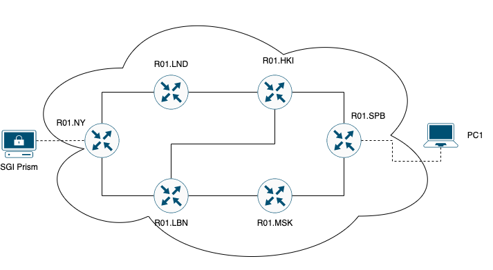

- Помимо этого вам необходимо настроить IP адреса на интерфейсах.
- Настроить OSPF и MPLS.
- Настроить EoMPLS.
- Назначить адресацию на контейнеры, связанные между собой EoMPLS.
- Настроить имена устройств, сменить логины и пароли.

# Схема

Схема, построенная в draw.io:

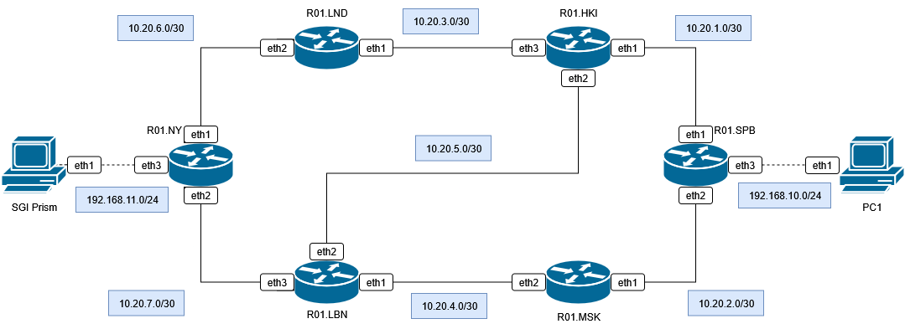

Схема, построенная ContainerLab:

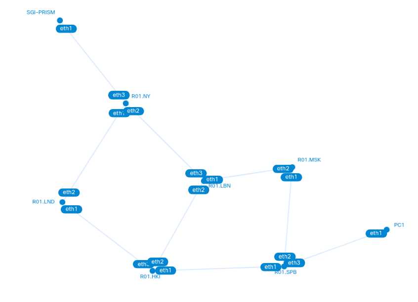

# Конфиг yaml

Конфигурация сети аналогична вариантом предыдущим лабораторным работам. 6 роутеров, компьютер, а также SGI-PRISM тоже репрезентуется компьютером.

Сеть управления: 172.16.16.0/24.

# Конфиги

## Роутеры

В system identity указывается новый пользователь и удаляется админ, по классике. Дальше интересно:

1) Прописываем, как обычно, интерфейсы на всех портах по нарисованной схеме. Прописываем в роутерах NY и SPB dhcp-сервера.
2) Настраиваем динамическую маршрутизацию osfp:
- /interface bridge add name=loopback (в ospf хорошо использовать loopback, т.к. это интерфейс с IP-адресом, который никогда не упадёт без вмешательства администратора)
- /ip address interface=loopback
- /routing ospf instance (указываем в router-id адрес loopback интерфейса)
- /routing ospf area (всего 6 роутеров, достаточно одной зоны для всех устройств, например, 0.0.0.0)
- /routing ospf network (указываем имя зоны из предыдущего пункта, а в сетях все физические подключения)
3) Настраиваем MPLS:
- /mpls ldp (для transport-address тоже для удобства используем адрес loopback. В lsr-id можно тоже его указать, ведь адрес уникальный)
- /mpls ldp advertise-filter & accept-filter (Можно ограничить, какие префиксы сетей будут получать ярлыки. Необязательный пункт для нашей сети! Это актуально для больших корпоративных сетей. Я попробовала ввести префикс интерфейсов loopback-а, после чего связь по обычным адресам 10.20.x.x не сопровождается присваиванием ярлыков, а вот по адресам loopback-а в traceroute можно увидеть, как mpls включается в работу.)
/mpls ldp interface (просто указываем все интерфейсы роутеров)
4) Настраиваем EoMPLS- хм.

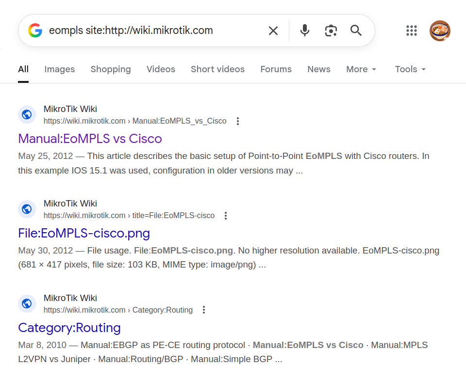

Хм-хм...

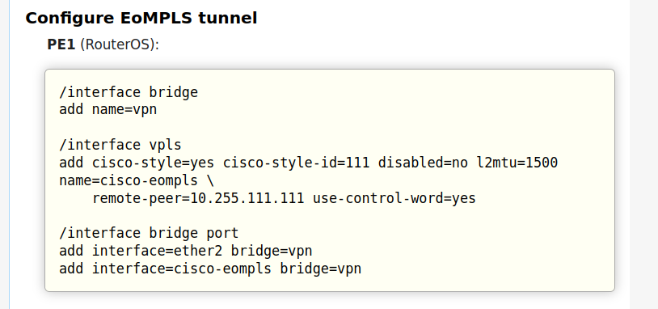

...?

VPLS и EoMPLS это [не совсем одно и то же](https://netseccloud.com/eompls-vs-vpls-choosing-the-right-mpls-solution-for-your-network)
. Обе технологии используются для транспортировки кадров Ethernet над сетью MPLS. Но VPLS подходит для больших корпораций, а EoMPLS для сетей поменьше. 

Но в документации микротика не видно, чтобы они назывались в конфигах по разному. Что там /interface vpls, что там, но в 1 странице документации это ["EoMPLS with Cisco routers"](https://wiki.mikrotik.com/Manual:EoMPLS_vs_Cisco), а в другой это ["Cisco style static VPLS interface"](https://wiki.mikrotik.com/Manual:Cisco_VPLS).

Ну, ладно, функционал один и тот же, так что продолжаем.

4) Настраиваем VPLS (только на NY и SPB роутерах)
- /interface bridge (наш впн, который соединим с интерфейсом vpls и портом каким-нибудь)
- /interface vpls (remote-peer: айпи loopback-интерфейса другого роутера)
- /interface bridge port

## Компьютеры

Аналогично предыдущим работам, компьютеры запрашивают айпи у соответствующего dhcp-сервера на eth1.

# Результаты

## 1: OSPF

Проверяем динамическую маршрутизацию... через таблицы маршрутизации!

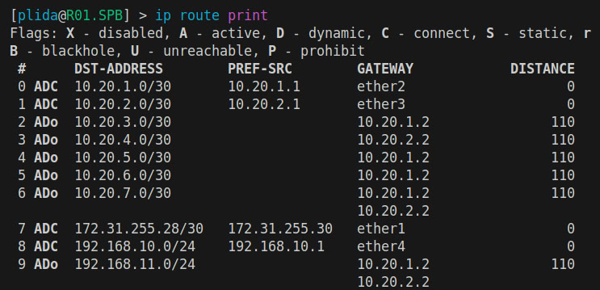
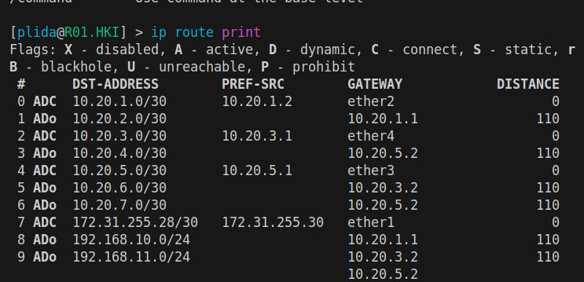
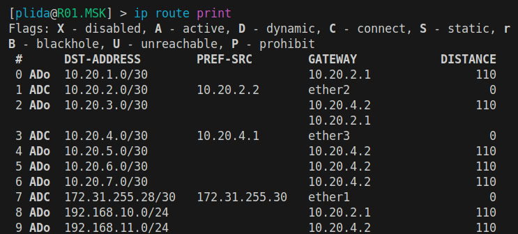
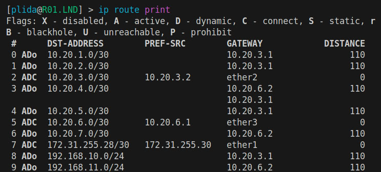
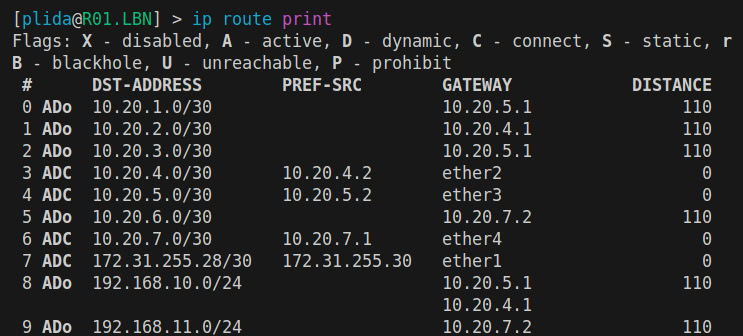
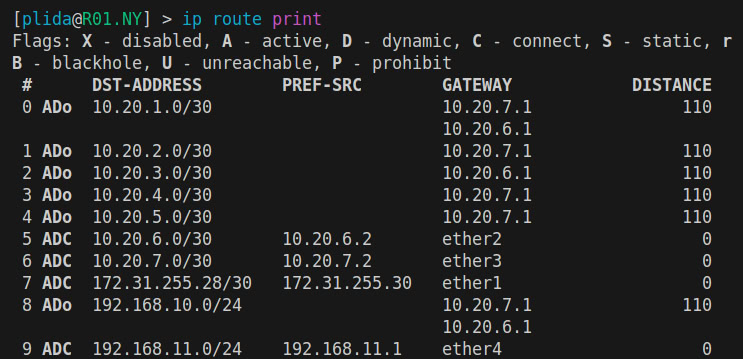

Как можно заметить, нигде статические маршруты не были прописаны, всё настроено динамически.

## 2: MPLS

Без фильтрации:

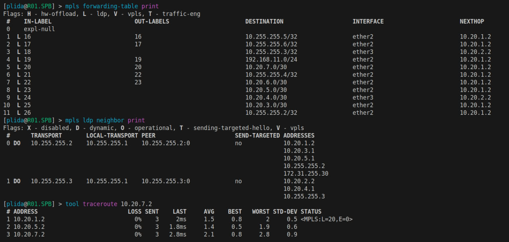
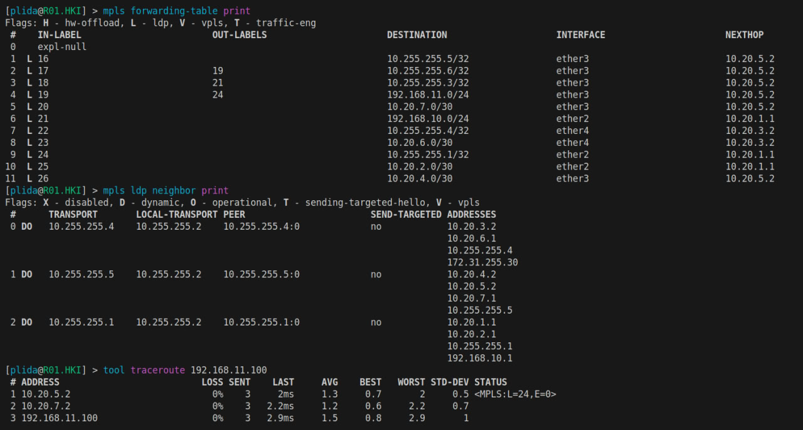
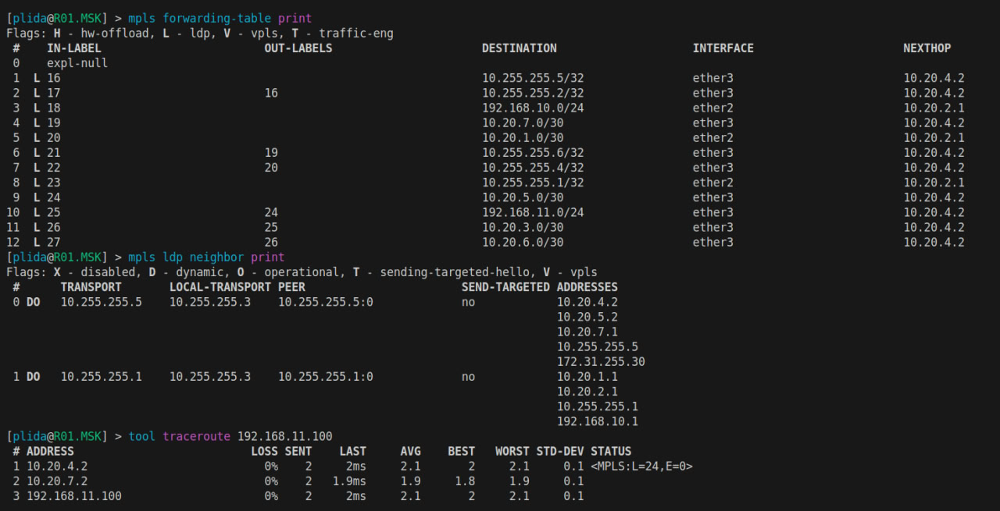
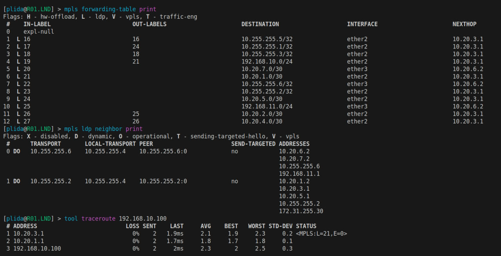
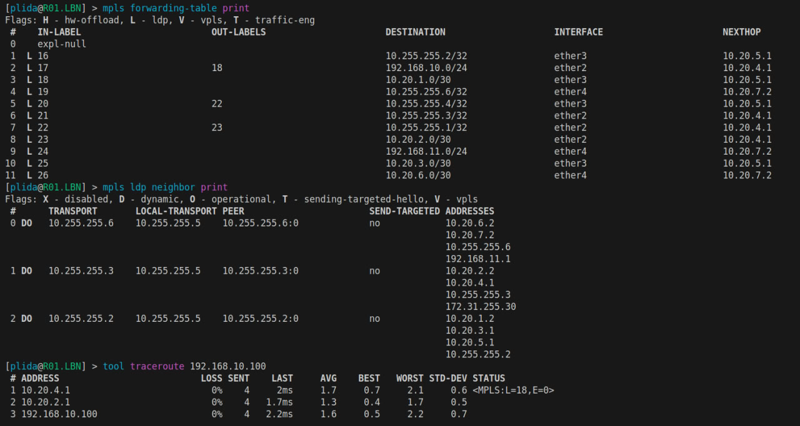
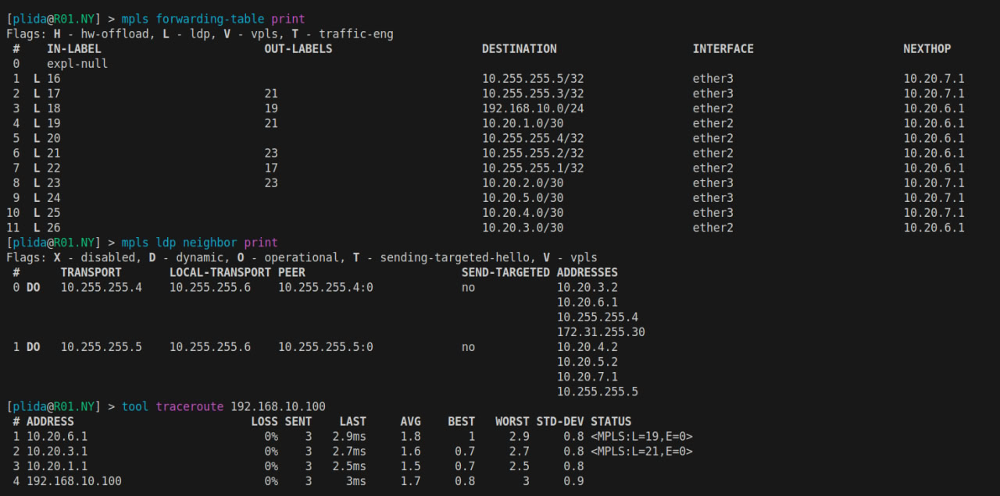

С фильтрацией:

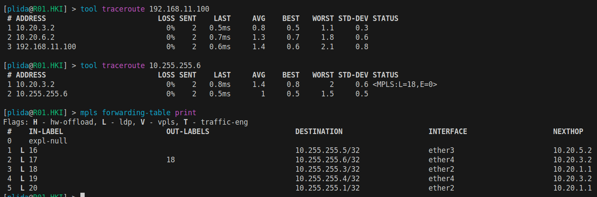

## 3: VPLS

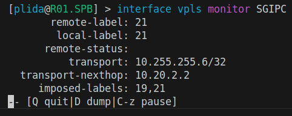
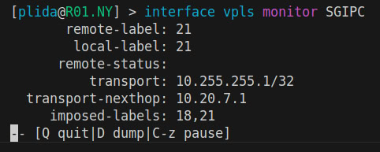

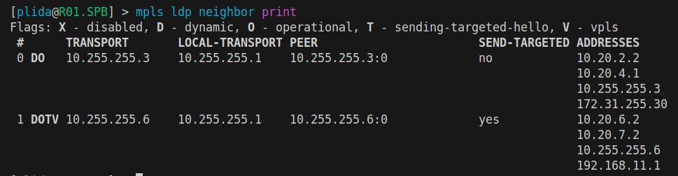
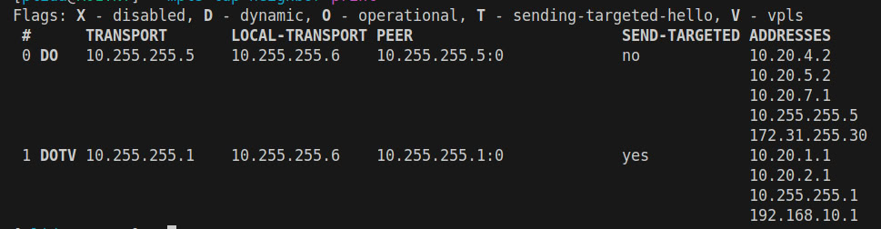

## Соединение компьютеров

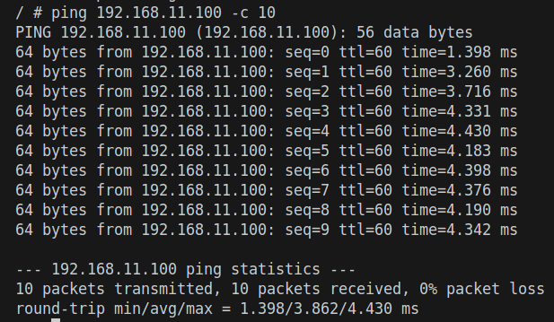

# Заключение

В ходе выполнения работы была настроена динамическая маршрутизация через osfp, поверх чего была положена сеть mpls, а также был проведён туннель vpls между роутерами NY и SPB.

Все устройства успешно соединены, задачи работы выполнены.

Цель создания IP/MPLS сети была выполнена.

# Источники

1. MikroTik Для больших дядей часть 4: https://vasilevkirill.ru/articles/routeros-dbd-4/

2. MikroTik Для больших дядей часть 5: https://vasilevkirill.ru/articles/routeros-dbd-5/

3. OSPF Mikrotik. Полная инструкция по настройки OSPF на Микротик: https://itproffi.ru/ospf-mikrotik-polnaya-instruktsiya-po-nastrojki-ospf-na-mikrotik/

4. Mikrotik Forum: "Is it necessary to set-up a loopback interface for each router in a OSPF scenario?": https://forum.mikrotik.com/t/ospf-loopback-interface/102588

5. Что такое loopback интерфейс: https://mikrotik-training.ru/kb/sozdanie-loopback-interfejsov-v-routeros/

6. Разница между EoMPLS и VPLS: https://netseccloud.com/eompls-vs-vpls-choosing-the-right-mpls-solution-for-your-network

7. Документация Mikrotik, настройка VPLS: https://wiki.mikrotik.com/Manual:EoMPLS_vs_Cisco