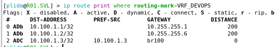
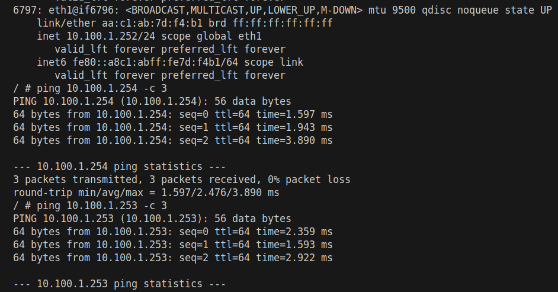

University: [ITMO University](https://itmo.ru/ru/) 
Faculty: [FICT](https://fict.itmo.ru) 
Course: [Introduction in routing](https://github.com/itmo-ict-faculty/introduction-in-routing) 
Year: 2025/2026 
Group: K3323 
Author: Krestyanova Elisaveta Fedorovna 
Lab: Lab4 
Date of create: 13.10.2025 
Date of finished: 20.10.2025 

# Задание

Вам необходимо сделать IP/MPLS сеть связи для "RogaIKopita Games" изображенную на рисунке 1 в ContainerLab. Необходимо создать все устройства указанные на схеме и соединения между ними.

- Помимо этого вам необходимо настроить IP адреса на интерфейсах.
- Настроить OSPF и MPLS.
- Настроить iBGP с route reflector кластером

И вот тут лабораторная работа работа разделяется на 2 части, в первой части вам надо настроить L3VPN, во второй настроить VPLS, но при этом менять топологию не требуется. Вы можете просто разобрать VRF и на их месте собрать VPLS.

Первая часть:
- Настроить iBGP RR Cluster.
- Настроить VRF на 3 роутерах.
- Настроить RD и RT на 3 роутерах.
- Настроить IP адреса в VRF.
- Проверить связность между VRF
- Настроить имена устройств, сменить логины и пароли.

Вторая часть:
- Разобрать VRF на 3 роутерах (или отвязать их от интерфейсов).
- Настроить VPLS на 3 роутерах.
- Настроить IP адресацию на PC1,2,3 в одной сети.
- Проверить связность.

# Схема

Схема, построенная в draw.io:

Схема, построенная ContainerLab:

# Конфиг yaml

Конфигурация сети аналогична вариантом предыдущим лабораторным работам. 6 роутеров, 3 компьютера.

Сеть управления: 172.16.16.0/24.

# Конфиги

## Роутеры

### OSPF + MPLS

Настройка OSPF + MPLS берётся из предыдущей работы с небольшими изменениями портов и подключённых сетей в соответствии с изменённой схемой сети.

### iBGP c Route Reflector кластером
 
1. Выбираем ASN

AS — система сетей под управлением единственной административной зоны. У нас только 1 такая зона, поэтому выбираем 1 приватное (64512-65534) число, например 65000.

2. Настраиваем iBGP

Мы работаем в рамках 1 зоны, поэтому мы используем протокол iBGP. Т.е. в конфигах мы будем указывать номер зоны конфигурируемого роутера как 65000, и в пирах/соседях тоже будет номер зоны 65000.

- `/routing bgp instance` (set default, номер AS и айди роутера. Здесь снова пользуемся айди таким же, что и у loopback)
- `/routing bgp peer` (remote-address, remote-as, route-reflect между RR роутерами, address-families=l2vpn,vpnv4, привязываем к loopback)
- `/routing bgp network` (сеть loopback)

3. Настраиваем vrf на внешних роутерах

- /interface bridge (привяжем рут vrf и свой адрес к мосту); 
- /ip address (адрес для моста, с 32-й маской)
- /ip route vrf (export-route-targets, import-route-targets, route-distinguisher с тем же ASN, routing-mark)
- /routing bgp instance vrf (redistribute-connected=yes и тот же routing-mark)

Вот здесь, преисполнившись чтением документации, важно не дать cluster-id кластеру роутеров :) В данной работе роутеры подключены только к одному RR-рефлектору, поэтому им надо пройти через 2 RR, чтобы друг к другу прийти. А что будет делать RR, получивший запрос со своим же cluster-id? Правильно, его дропать. 

4. Часть 2: Настраиваем VPLS

В 1-й части это было неактуально, сейчас важно отметить. В /mpls ldp interface нужно указать интерфейс, направленный на компьютер.

На всех 3-ёх внешних роутерах настраиваем:

- /interface bridge (имя)
- /interface bridge port (привязываем к порту, направленный на компьютер)
- /interface vpls bgp-vpls (тоже руты как у /ip route vrf, вместо routing-mark site-id с уникальным айди для каждого роутера)
- /ip address (привязываем к мосту)

Чтобы задать айпи всем компьютерам в одной этой сети впн-а, надо выбрать, на каком роутере поставить dhcp-сервер. Допустим, это будет Санкт-Петербургский.

На всех роутерах убираем/выключаем раздачу dhcp-адресов из 1-й части, на SPB создаём новый пул из сети впн и подключаем его к нему.

## Компьютеры

Аналогично предыдущим работам, в компьютеры запрашивают айпи у соответствующего dhcp-сервера на eth1 (в 2-й части этот сервер на SPB роутере).

# Результаты

Скриншоты результатов были собраны по ходу работы, а не в самом конце. Т.е. был успешно поставлен IBGP - были сняты скриншоты, а не после дальнейшей настройки впн.

## 1: OSPF

Проверяем динамическую маршрутизацию... через таблицы маршрутизации!

Как можно заметить, нигде статические маршруты не были прописаны, всё настроено динамически.

## 2: MPLS

## 3: iBGP

В `ip route print where bgp` показана метрика 200, когда как у ospf метрики были 110, то есть ospf будет в приоритете.

В `routing bgp peer print status` можно заметить флаг E - established. По нему можно увидеть, что все конфиги были настроены без ошибок.

## 4: VRF

Добавленные маршруты на внешних роутерах:

Пинги между внешними роутерами:

## 2-я часть: VPLS

Раздача айпи адресов через dhcp сервер на Санкт-Петербургском роутере:

Пинги между компьютерами:

# Заключение

В ходе работы была создана IP/MPLS сеть связи. На нём были настроены протоколы OSPF, MPLS и iBGP с Route Reflector-кластером.  

В 1-й части был настроен L3VPN, используя VRF, в 2-й части был настроен VPLS.

Все устройства были успешно соединены, задачи работы выполнены.

Цель работы была выполнена.

# Источники

1. BGP on a Mikrotik a complete configuration: https://tech.layer-x.com/bgp-on-mikrotik-a-complete-configuration-guide/

2. BGP на Mikrotik: https://www.cloudhosting.lv/rus/faq/BGP-na-Mikrotik 

3. Route Reflector: https://linkmeup.gitbook.io/sdsm/8.1.-ibgp/2.-problema-n-kvadrat/0.-route-reflector

4. Mikrotik VTF+NAT: https://habr.com/ru/articles/262091/

5. Разница между Route Distinguisher и Route Target: https://habr.com/ru/sandbox/99255/

6. Layer-3 MPLS VPN example (пример vrf настройки): https://web.archive.org/web/20241114213912/https://wiki.mikrotik.com/File:L3vpn.png

7. BGP based VPLS: https://web.archive.org/web/20241114204010/https://wiki.mikrotik.com/Manual:BGP_based_VPLS
